# 🍳 CookSmartAI – AI Powered Recipe & Meal Planner

A fully responsive, AI-powered web app that helps users **generate recipes**, create **meal plans**, analyze **nutritional values**, and explore a global recipe library — all with AI-generated images and sharing capabilities.
---

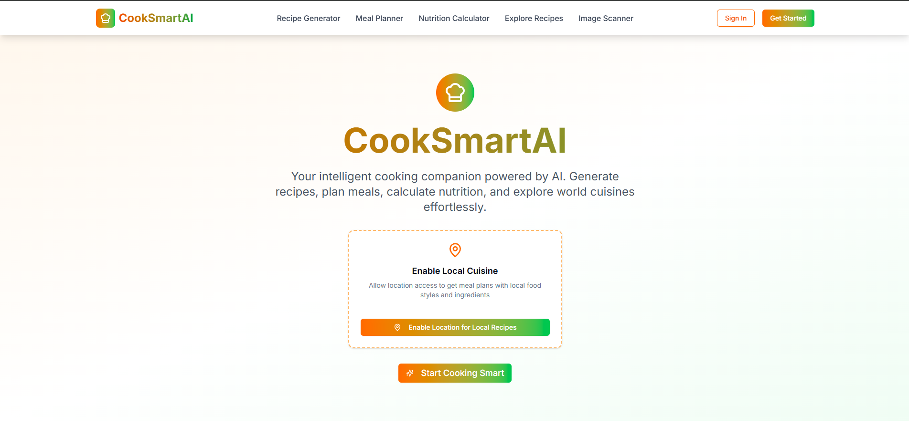

---

## 📝 About the Project

CookSmartAI is a **modern, AI culinary platform** that combines powerful machine learning with an elegant UI to transform the way people cook, plan meals, and track nutrition.

- Effortlessly **generate personalized recipes** from ingredients or descriptions.
- Create **custom meal plans** based on dietary preferences, allergies, budget, and serving size.
- Perform **deep nutritional analysis** with detailed macro & micro nutrient breakdowns.
- Explore a **global recipe hub** with user-generated content and advanced filtering.
- Save your favorite recipes & meal plans, or **share them instantly** on social platforms.
- Enjoy **AI-generated dish images** with the ability to regenerate in one click.

All features are integrated into a **fully responsive**, cross-device compatible web application powered by cutting-edge AI and cloud technologies.

🔗 [Live Demo (Vercel)](https://cook-smart-ai.vercel.app)

[](https://nextjs.org/)[](https://tailwindcss.com/)[](https://supabase.com/)[](https://www.prisma.io/)[](https://clerk.dev/)[](https://ai.google.dev/)[](https://huggingface.co/)[]()[](https://cron-job.org/)

---

## 🧠 Features

- ✅ **AI Recipe Generator**  
  Enter one or more ingredients or describe a dish, and get an **AI-generated recipe** with:
  - Title, description, ingredients, instructions  
  - Cooking time, preparation time, calories  
  - AI-generated dish image (with **regenerate image** button)  
  - Save to favorites, share via WhatsApp/Twitter/Email  

- 🍽️ **AI Meal Plan Generator**  
  Create customized meal plans by specifying:
  - Number of days, people, budget  
  - Dietary preferences & allergies  
  - Get AI insights, nutrition details, shopping list  
  - Download or save meal plans  

- 🧪 **AI Nutritional Calculator**  
  - Input ingredients or recipe description  
  - Get **detailed macro & micro nutrient breakdown**  
  - AI-powered insights & recommendations  
  - Download nutrition reports  

- 📷 **AI Image Scanner**  
  - Upload a food image  
  - Get AI-generated recipe or nutritional analysis  

- ⭐ **My Favorites**  
  - Save recipes & meal plans  
  - Download or share saved items  

- 🌍 **Explore Recipes**  
  - View all user-submitted recipes  
  - Advanced filters, search & global rating system  

- 📈 **Ratings System**  
  - Standard Weighted global rating updates daily via CRON job  

- 📄 **Additional Pages**  
  - About, Contact, Careers, Blog, Privacy Policy  

---

## 🚀 Tech Stack

| Area             | Tech Stack |
|------------------|------------|
| **Frontend**      | Next.js, React, Tailwind CSS |
| **Backend**       | Next.js API Routes |
| **Database**      | Supabase (PostgreSQL), Prisma ORM |
| **Authentication**| Clerk |
| **AI Models**     | Gemini API, Pollination AI (fallback: Hugging Face) |
| **Image Generation** | Pollination AI + Hugging Face |
| **Cron Jobs**     | cron-job.org |
| **UI**            | Tailwind CSS |
| **Hosting**       | Vercel |

---

## 📸 Screenshots

### 🌟 FullPage & ⭐ MyFavourites
| FullPage | MyFavourites |
|----------|--------------|
| 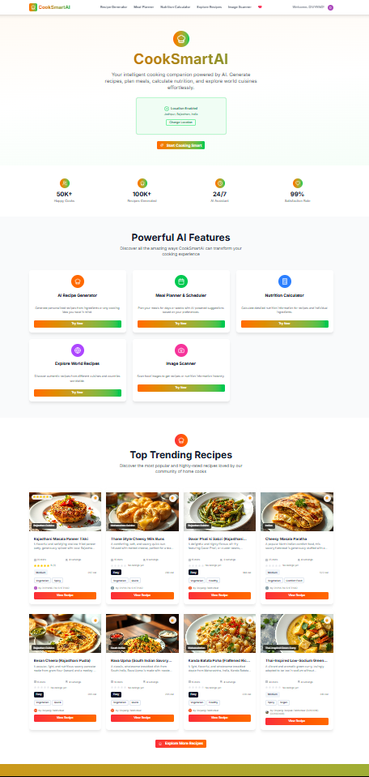 | 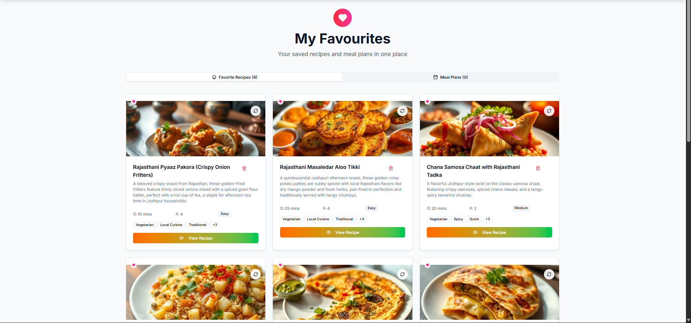 |

---


### 🔝 TopRecipes_HomePage & 🏠 landing_page_hero
| TopRecipes_HomePage | landing_page_hero |
|---------------------|------------------|
| 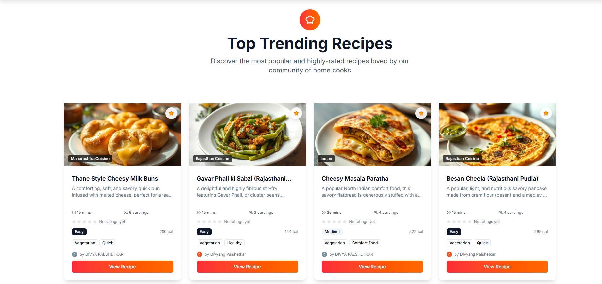 |  |
--- 


### 🍳 Ai_RecipeGenerated & 🧾 Ai_Recipgenerator
| Ai_RecipeGenerated | Ai_Recipgenerator |
|--------------------|------------------|
| 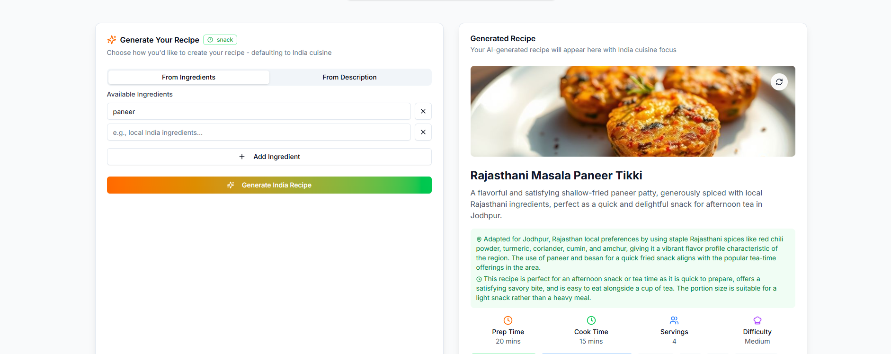 | 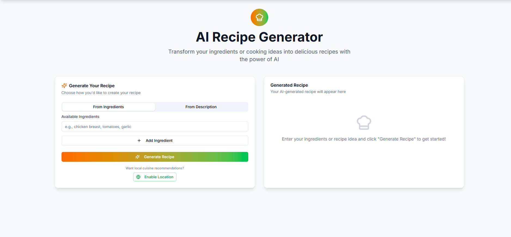 |

---
### 📷 Scanned Nutrition & 📷 Scanned recipe
| Scanned Nutrition | Scanned recipe |
|-------------------|----------------|
|  |  |

---

### 📱 AllmageScanner & 🥗 RecipeCard
| AllmageScanner | RecipeCard |
|----------------|------------|
|  | 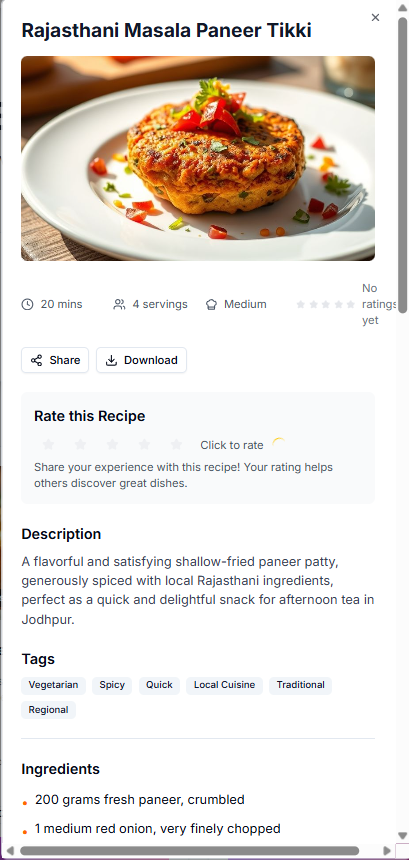 |

---

### 🌍 ExploreWorldRecipe & 🧪 NutritionCalculator
| ExploreWorldRecipe | NutritionCalculator |
|--------------------|---------------------|
| 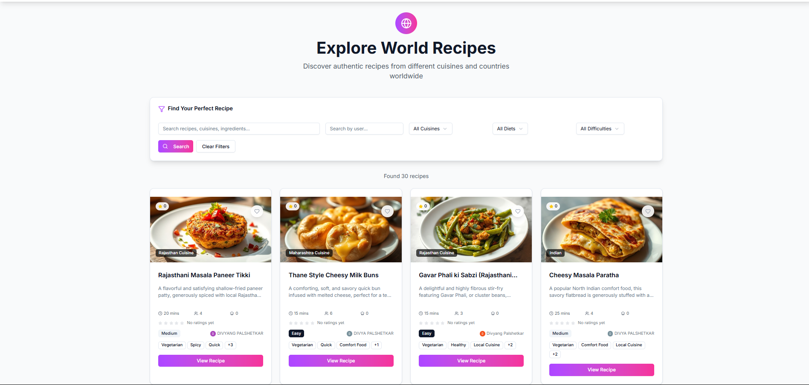 | 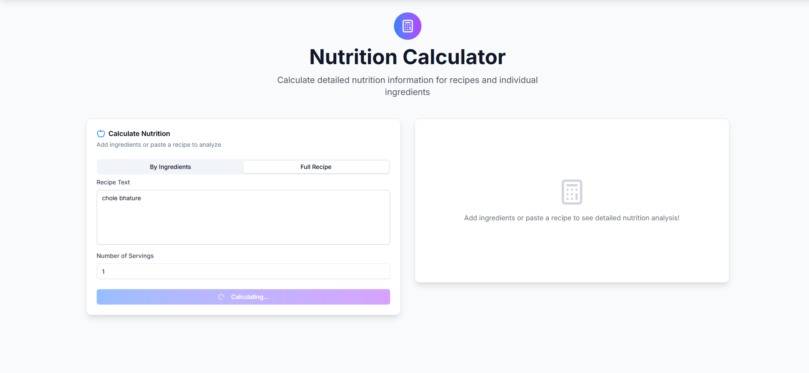 |

---

### 📊 DetailedNutritionCard & 📈 AllinsightsNutrition
| DetailedNutritionCard | AllinsightsNutrition |
|-----------------------|----------------------|
| 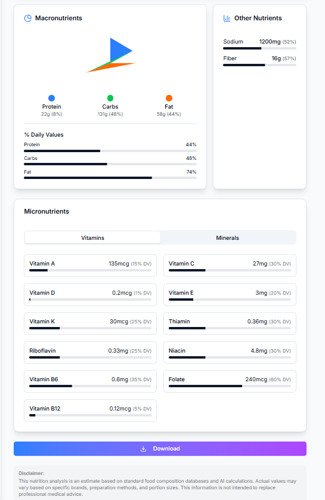 | 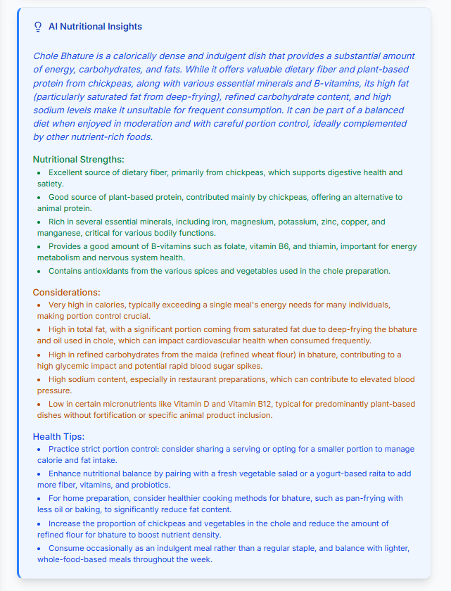 |

---

### 🧮 CalculatedNutrition & 🧾 PDF_MealPlan
| CalculatedNutrition | PDF_MealPlan |
|---------------------|--------------|
| 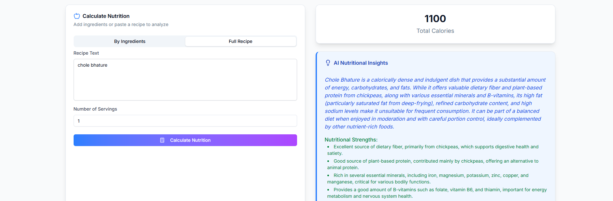 | 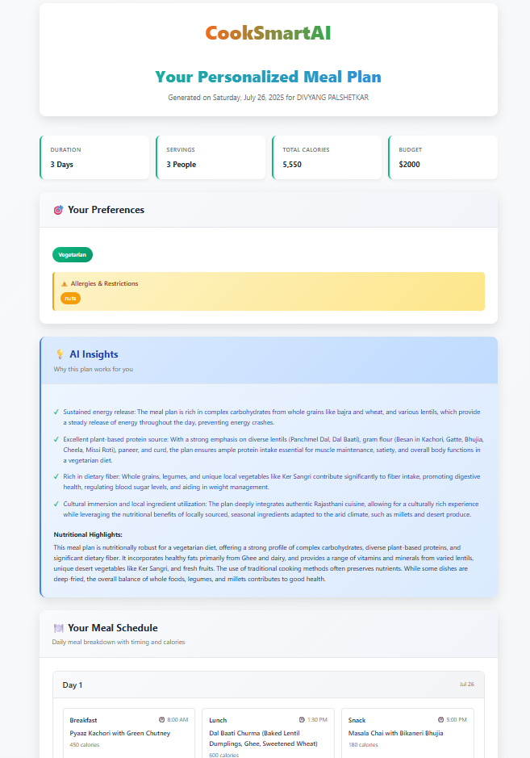 |

---

### 🛒 ShoppingList_Meal & 🍽️ GeneratedMealPlan
| ShoppingList_Meal | GeneratedMealPlan |
|-------------------|------------------|
| 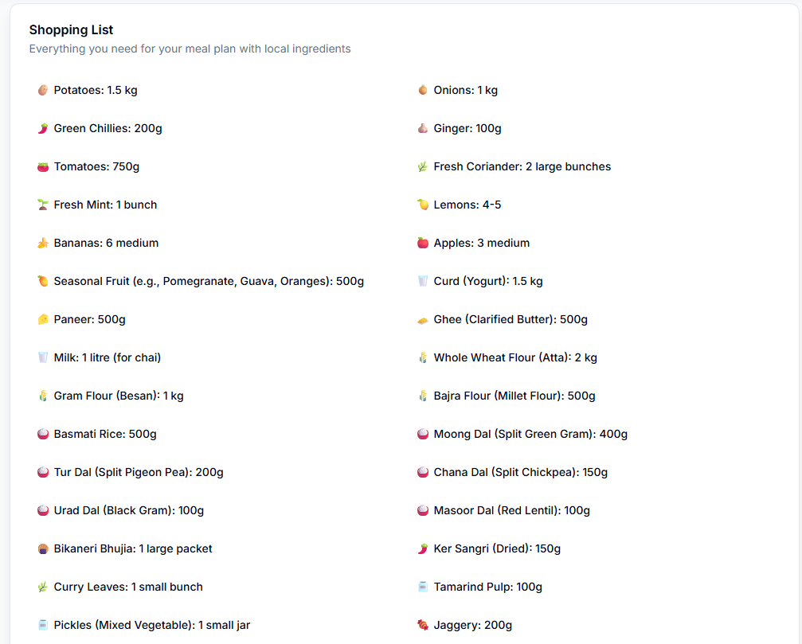 | 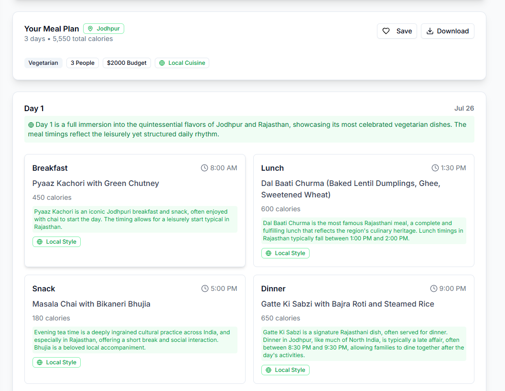 |

---

### 🧠 MealPlanAllinsights & 🤖 Ai_MealPlannerPage
| MealPlanAllinsights | Ai_MealPlannerPage |
|---------------------|-------------------|
| 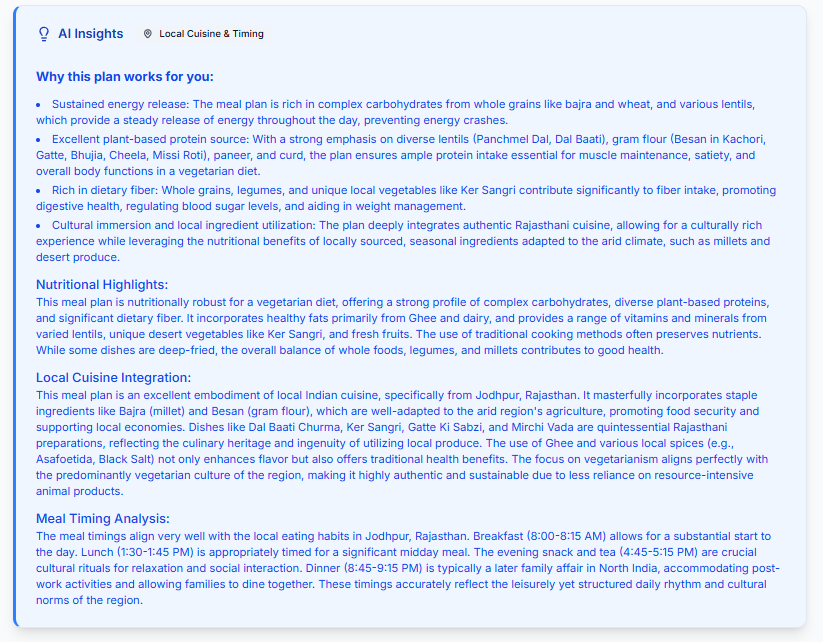 | 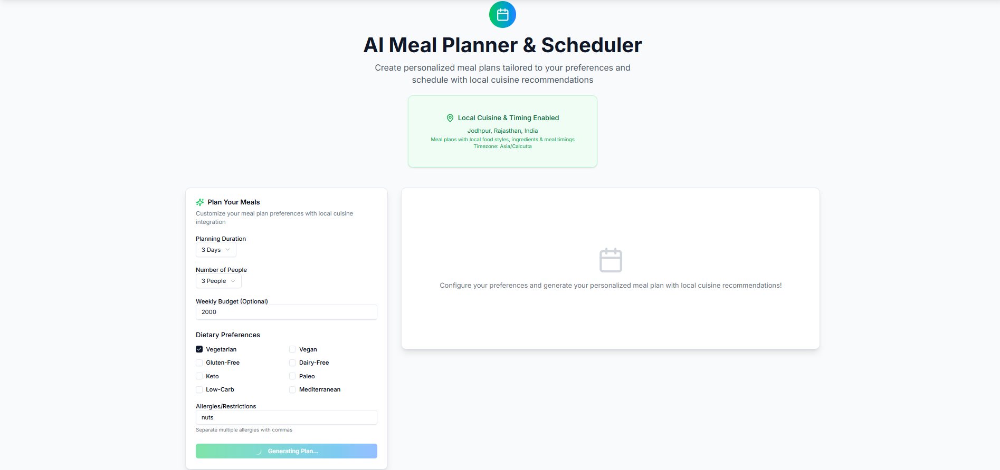 |

---

### 📤 ShareRecipeDialog & 🎨 Ai_ImageRegeneration
| ShareRecipeDialog | Ai_ImageRegeneration |
|-------------------|---------------------|
| 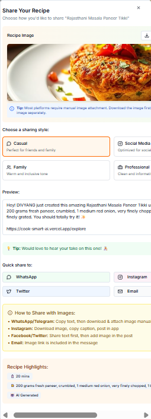 | 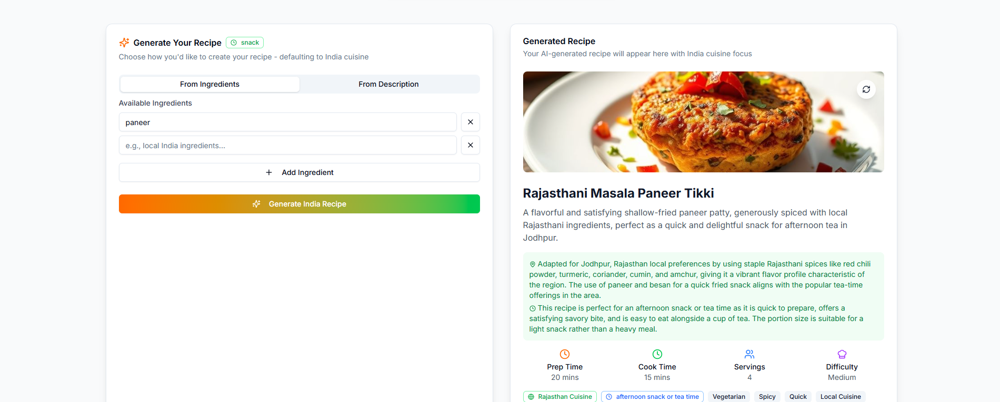 |

---


## 🤸 Quick Start

Follow these steps to set up the **ExpensIQ - AI Powered Personal Finance Manager** project locally on your machine.

### 🔧 Prerequisites

- Git
- Node.js (v18+)
- npm

### 📁 Cloning the Repository

```bash
git clone https://github.com/yourusername/CookSmartAI.git
cd expensiq
```
### 📦 Installation

```bash
npm install
```
#### 🧬 Prisma Setup
After installing dependencies and setting up environment variables, initialize your database:
```bash
npm i -D prisma
npx prisma init
npx prisma migrate dev --name create-models
```

### 🔐 Environment Variables

Make sure to create a `.env` file in root of your project with the following variables:

```env
DATABASE_URL=
DIRECT_URL=
NEXT_PUBLIC_CLERK_PUBLISHABLE_KEY=
CLERK_SECRET_KEY=
NEXT_PUBLIC_SUPABASE_URL=
NEXT_PUBLIC_SUPABASE_ANON_KEY=
GEMINI_API_KEY=
CRON_SECRET=
HUGGING_FACE_API_KEY=

```
Replace the placeholder values with your actual credentials.

### ▶️ Running the Project

```bash
npm run dev
```
Open http://localhost:3000 in your browser to view the project.

---

## 🆘 Support

If you find this project useful, consider giving it a ⭐  

---

## 🧑 Authors

- [@DivyangP2003](https://github.com/DivyangP2003)

---
## 🙏 Acknowledgements

Special thanks to the following platforms for their tools:

- [Clerk](https://clerk.dev) – authentication and user management
- [Supabase](https://supabase.io) – backend database and real-time support
- [Cron-job.org](https://cron-job.org/en) – background jobs and CRON scheduling
- [ShadCN UI](https://ui.shadcn.com/) – UI component library
- [Gemini API (Google AI)](https://ai.google.dev/) – AI for analysis and image analysis
- [Pollination AI](https://pollinations.ai) - AI for geneartion of receipe image and regeneration of image
- [Vercel](https://vercel.com) – frontend hosting and CI/CD
